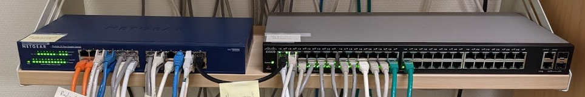
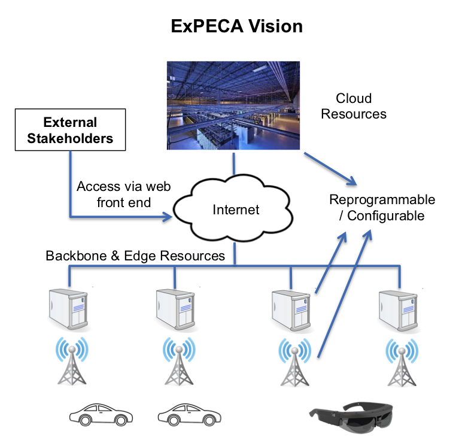

# Welcome

## The ExPECA Testbed

!!! quote ""

    The Experimental Platform for Edge Computing Applications (ExPECA) is an SSF-funded infrastructure project targeting the development and provisioning of an edge computing infrastructure for research into novel applications and network architectures.
    It is owned and developed by [Professor James Gross'](https://jamesgross.org) group at the [division of Information Science and Engineering of the School of Electrical Engineering and Computer Science at KTH](https://www.kth.se/is/ise/division-of-information-science-and-engineering-1.790272).

Today's data networks and cloud-computing infrastructure are highly optimized toward common applications with *downlink-dominant* network traffic characteristics, such as web-browsing and video- and music streaming, that prioritize bandwidth over responsiveness.
However, they are unsuitable for novel emerging closed-loop applications, such as networked control systems or immersive AR, which have completely different traffic characteristics and require extremely low round-trip latencies.
This has led to the emergence of a new distributed computing paradigm which aims to deploy networked computing resources as close to the application as possible.
Known as *Edge Computing*, this paradigm is quickly becoming reality together with new networking technologies (5G, beyond-5G) which further benefit these highly latency-constrained applications.

However, while it is widely understood that Edge Computing brings much-needed improvements in performance, little is known yet about the detailed characteristics of these systems and their implications for applications.
Essentially, there is a gap between theoretical work and the achievable performance of edge computing systems in practice, a gap that must be bridged before these systems can become a widespread reality.

Our goal with the ExPECA testbed is to bridge this gap.
We provide a cluster of hardware-reconfigurable general-purpose computing nodes interconnected using managed switches and Software-Defined Radios.
This allows us to quickly, on-the-fly, and in an automated fashion change the characteristics of the cluster and the network, in order to study different Edge- and Cloud-computing deployments and the applications that run on them.

[^1]: ExPECA Vision Image courtesy of [jamesgross.org](https://www.jamesgross.org/research/expeca/).
