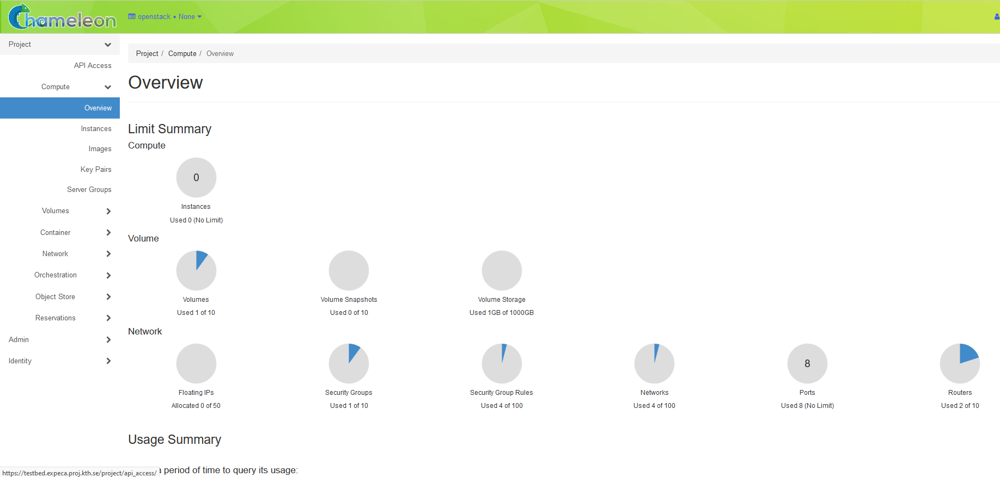

# Getting started

This guide will walk you through the initial steps of getting an account
and describe how to use the testbed.

## Step 1: Get a user account

To get a user account, send an email to expeca-proj@kth.se with

* "ExPECA account request" in the subject header
* Name
* Phone number
* Email address
* Reason for the account request

After your request has been granted, we will then send you a reply with your login credentials.

## Step 2: Log in to the ExPECA testbed

Just click the “Access the Testbed” button situated at the top of the ExPECA main page and use your received credentials for login.

## Step 3: Start using the ExPECA testbed

Congratulations, you are now ready to start using the testbed! 
When you have logged in, you will first see the ExPECA dashboard.
The dashboard shows a summary of your project's current resource usage and looks something like this:

You can reserve worker nodes and radio resources, as well as defining networking for your experiments.
Worker nodes are servers in the testbed, where you do not have full access 
to the actual server, but you can allocate and run Docker containerized applications on them.
When you reserve a worker node, you have exclusive access to the underlying server.
The following sections will describe how to make reservations and practically use the resources in the testbed.

Good luck!
